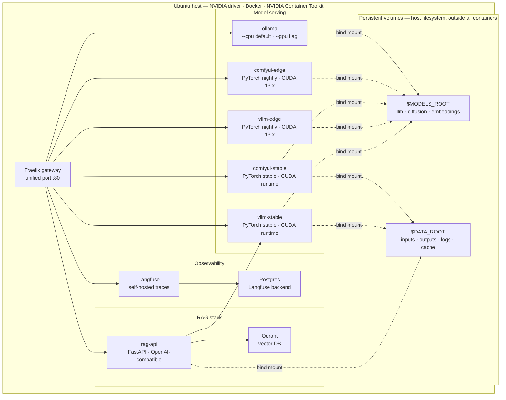

# rig-stack

**Self-hosted AI inference stack for NVIDIA Blackwell. Your RTX 5090 as a private cloud.**

Most AI tooling gives you an API key and a billing page. rig-stack gives you the whole stack — running on your hardware, under your control, at zero per-token cost.

The motivation is practical. An RTX 5090 is a serious machine. Getting the most out of it means:

- **Running the right build for the job.** vLLM and ComfyUI ship both a stable release and a nightly edge build compiled for Blackwell (sm_120, CUDA 13.0). Edge unlocks the full performance of the card — stable keeps you unblocked when nightly breaks.
- **Splitting the GPU intelligently.** Load your large LLM on the GPU via vLLM, and offload utility models — embeddings, small chat, vision — to Ollama running on CPU. No context switching, no reloading.
- **Tuning without rewriting configs.** Every service is driven by preset files. Switch from a high-throughput quantized build to a quality full-precision run with one command. Presets live in the repo and are version-controlled.
- **A CLI that feels native.** `rig` follows Debian UX conventions — subcommands, consistent flags, tab completion, clean output. No YAML archaeology, no Docker command memorisation.

Drop it on Ubuntu 24.04, run `./install.sh`, and the full stack — LLM serving, image generation, RAG, observability — is one `rig` command away.

---

## What's included

| Component | Stack | Route |
|---|---|---|
| LLM inference | vLLM (stable + Blackwell-edge) | `/v1` |
| Image generation | ComfyUI (stable + Blackwell-edge) | `/comfy` |
| Utility models | Ollama (CPU/GPU) | `/ollama` |
| RAG API | FastAPI + Qdrant | `/rag` |
| Observability | Langfuse (self-hosted) | `/langfuse` |
| Gateway | Traefik | port 80 |

---

## Prerequisites

- Ubuntu 24.04 (or Debian-family with `OS_FAMILY=debian` in `.env`)
- NVIDIA RTX 5090 (or any NVIDIA GPU ≥ RTX 30xx; Blackwell features require RTX 50xx)
- NVIDIA driver ≥ 550
- Docker CE (not snap)
- NVIDIA Container Toolkit

Or just run `./install.sh` — it handles all of the above.

---

## Quick start

```bash
# 1. Clone and configure
git clone <repo> rig-stack && cd rig-stack
cp .env.example .env
# Edit .env — set MODELS_ROOT, DATA_ROOT, DOCKER_ROOT to match your server

# 2. Install everything (driver, Docker, toolkit, CLI)
./install.sh

# 3. Download models
rig models init --minimal

# 4. Start serving
rig serve qwen3-5-27b
```

The LLM endpoint is live at `http://localhost/v1`.

---

## CLI reference

```
rig <command> [subcommand] [flags]
```

### serve — vLLM inference

| Command | Description |
|---|---|
| `rig serve <preset>` | Start vLLM stable with a preset |
| `rig serve <preset> --edge` | Use Blackwell/sm_120 edge container |
| `rig serve list` | Table of all presets (model, context, kv-cache, gpu-util) |
| `rig serve stop` | Stop vLLM |

### comfy — image generation

| Command | Description |
|---|---|
| `rig comfy start <preset>` | Start ComfyUI stable with a preset |
| `rig comfy start <preset> --edge` | Use edge container |
| `rig comfy stop` | Stop ComfyUI |
| `rig comfy list` | List available presets |
| `rig comfy workflows` | List saved workflow JSON files |

### ollama — utility models

| Command | Description |
|---|---|
| `rig ollama start [<preset>...]` | Start Ollama and preload up to 3 models in VRAM |
| `rig ollama start <p1> <p2> --gpu` | Start with GPU |
| `rig ollama stop` | Stop Ollama |
| `rig ollama list` | List available presets |

Presets are optional — Ollama loads any model on first request. Passing presets pre-warms VRAM to eliminate cold starts. Up to 3 models stay loaded simultaneously; Ollama evicts the least recently used when a new one is requested beyond the limit.

### rag — retrieval API

| Command | Description |
|---|---|
| `rig rag start` | Start RAG API + Qdrant |
| `rig rag stop` | Stop RAG stack |
| `rig rag status` | Health check |

### models — model management

| Command | Description |
|---|---|
| `rig models` | List all models: name, category, size |
| `rig models pull <hf-repo>` | Download from HuggingFace |
| `rig models show <name>` | Path, size, associated presets |
| `rig models remove <name>` | Delete from disk |

### presets — configuration management

| Command | Description |
|---|---|
| `rig presets` | List all presets: service, name, model, key params |
| `rig presets show <name>` | Full preset config dump |
| `rig presets set <service> <preset>` | Set active preset (picked up on next start) |

### observability

| Command | Description |
|---|---|
| `rig status` | Active services, loaded models, active presets |
| `rig stats` | GPU VRAM, watt, temp, active containers, tokens/sec |

---

## Architecture



---

## Folder map

```
rig-stack/
  README.md          ← you are here
  install.sh         ← full setup orchestrator
  compose.yaml       ← all containers, profile-gated
  .env.example       ← all variables documented
  .env               ← gitignored

  services/          ← Dockerfiles for each workload
    vllm/            ← Dockerfile.stable + Dockerfile.edge
    comfyui/         ← Dockerfile.stable + Dockerfile.edge
    ollama/
    rag/             ← FastAPI source + Dockerfile
    langfuse/

  config/            ← static config files
    traefik/
    qdrant/
    langfuse/

  presets/           ← model + operational params per service
    vllm/            ← qwen3-5-27b.env, qwen3-5-27b-fast.env, ...
    comfyui/
    ollama/

  cli/               ← rig CLI source
    rig              ← entrypoint
    lib/             ← one file per command group
    completions/     ← bash + zsh tab completion

  scripts/
    setup/           ← 00-init-dirs through 05-install-cli
    models/          ← pull, list, show, remove, init
    maintenance/     ← backup, update
```

---

## $MODELS_ROOT layout

```
$MODELS_ROOT/               # default: /models
  llm/
    qwen3-5-27b/            # Kbenkhaled/Qwen3.5-27B-NVFP4
    qwen3-5-27b-distilled/  # qwen3-5-27b-open-4-6-distilled-v2
    qwen2-vl-7b/            # Qwen/Qwen2-VL-7B-Instruct (image workflows)
  diffusion/
    flux2-fp8/              # FLUX.2-dev fp8 quantized (default, gated)
    flux2-klein/            # FLUX.2-klein (Apache 2.0, fastest)
    flux1-dev/              # FLUX.1-dev (ControlNet/edit workflows, gated)
    flux1-fill/             # FLUX.1-Fill-dev (inpainting/edit, gated)
    flux-lora/
  controlnet/               # ControlNet models (canny, depth, union-pro)
  upscalers/
    gfpgan/                 # GFPGANv1.4.pth
    real-esrgan/            # RealESRGAN_x4plus.pth
  face/
    facefusion/             # inswapper_128.onnx, buffalo_l (ArcFace)
  starvector/
    starvector-8b-im2svg/
  embeddings/
    nomic-embed-text/
  ollama/                   # Ollama model cache (managed by Ollama)
```

## $DATA_ROOT layout

```
$DATA_ROOT/                 # default: /data
  inputs/
  outputs/
    vllm/
    comfyui/
  workflows/
    comfyui/                # save ComfyUI workflow JSON files here
  datasets/
    raw/
    captioned/
  lora/
    training/
    output/
  logs/                     # per-service log dirs
  cache/
    huggingface/
    torch/
  qdrant/                   # Qdrant vector store
  postgres/                 # Langfuse DB
```

---

## How to add a model

```bash
# Download directly
rig models pull <huggingface-repo-id>

# Or use the script with explicit destination
bash scripts/models/pull-model.sh <hf-repo> <local-subdir>
# e.g.
bash scripts/models/pull-model.sh black-forest-labs/FLUX.1-schnell diffusion/flux-schnell
```

For gated models (some Llama, Qwen variants), set `HF_TOKEN` in your `.env`.

---

## How to add a preset

A **preset** is an env file in `presets/<service>/` with operational parameters for the model server. Create one by copying an existing preset and adjusting the values:

```bash
cp presets/vllm/qwen3-5-27b.env presets/vllm/my-preset.env
# Edit my-preset.env
rig serve my-preset
```

See `presets/README.md` for the full parameter reference.

---

## How to rebuild edge images

Edge images (Blackwell/sm_120) need to be rebuilt when PyTorch nightly or vLLM updates significantly:

```bash
bash scripts/setup/04-build-edge-images.sh
```

Or to update all images:

```bash
bash scripts/maintenance/update-images.sh
```

---

## Observability URLs

| Service | URL |
|---|---|
| vLLM API | `http://localhost/v1/models` |
| ComfyUI | `http://localhost/comfy` |
| Ollama | `http://localhost/ollama` |
| RAG API | `http://localhost/rag/health` |
| Langfuse | `http://localhost/langfuse` |
| Traefik dashboard | `http://localhost:8080` |
| Qdrant dashboard | `http://localhost:6333/dashboard` |

---

## Mount point configuration

If your server uses different paths than `/models`, `/data`, `/docker`, edit `.env`:

```bash
MODELS_ROOT=/your/models/path
DATA_ROOT=/your/data/path
DOCKER_ROOT=/your/docker/path
```

Run `bash scripts/setup/00-init-dirs.sh` to create the subdirectory tree at the new paths.

---

## Extending to other GPUs / OS

| Variable | Options | Effect |
|---|---|---|
| `GPU_MODEL` | `rtx5090`, `rtx4090`, etc. | Validation messaging in setup scripts |
| `OS_FAMILY` | `ubuntu`, `debian`, `macos` | Package manager selection in setup scripts |
| `OS_VERSION` | `24.04`, `22.04`, etc. | Apt codename resolution |

For non-Blackwell GPUs, use `rig serve <preset>` (stable container) — the edge container is only needed for sm_120 (RTX 5090).
