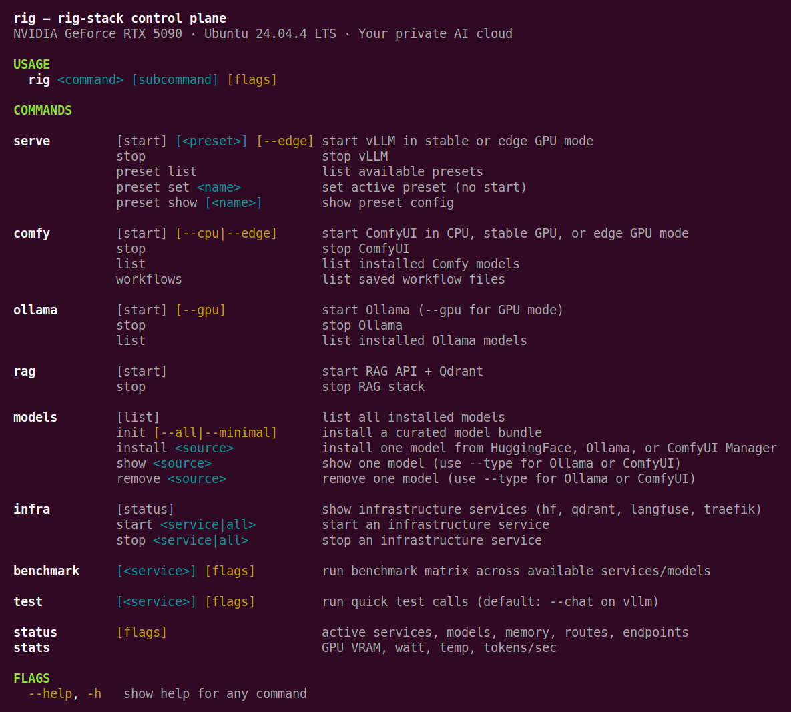
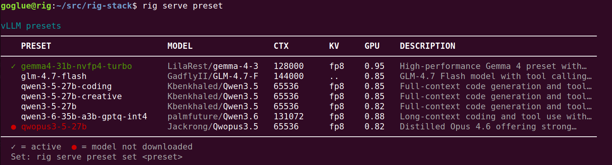
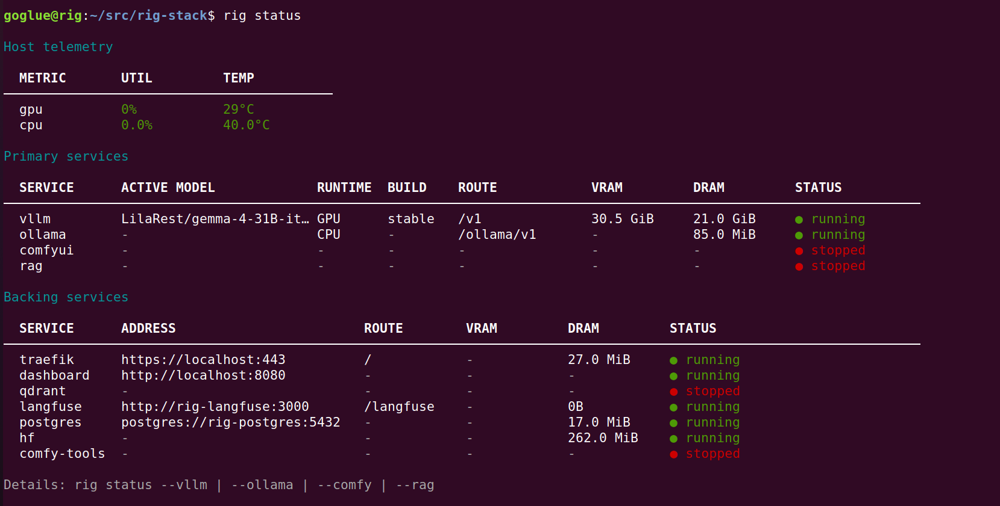
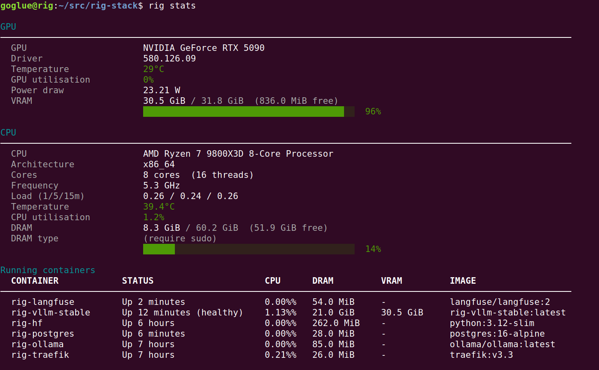
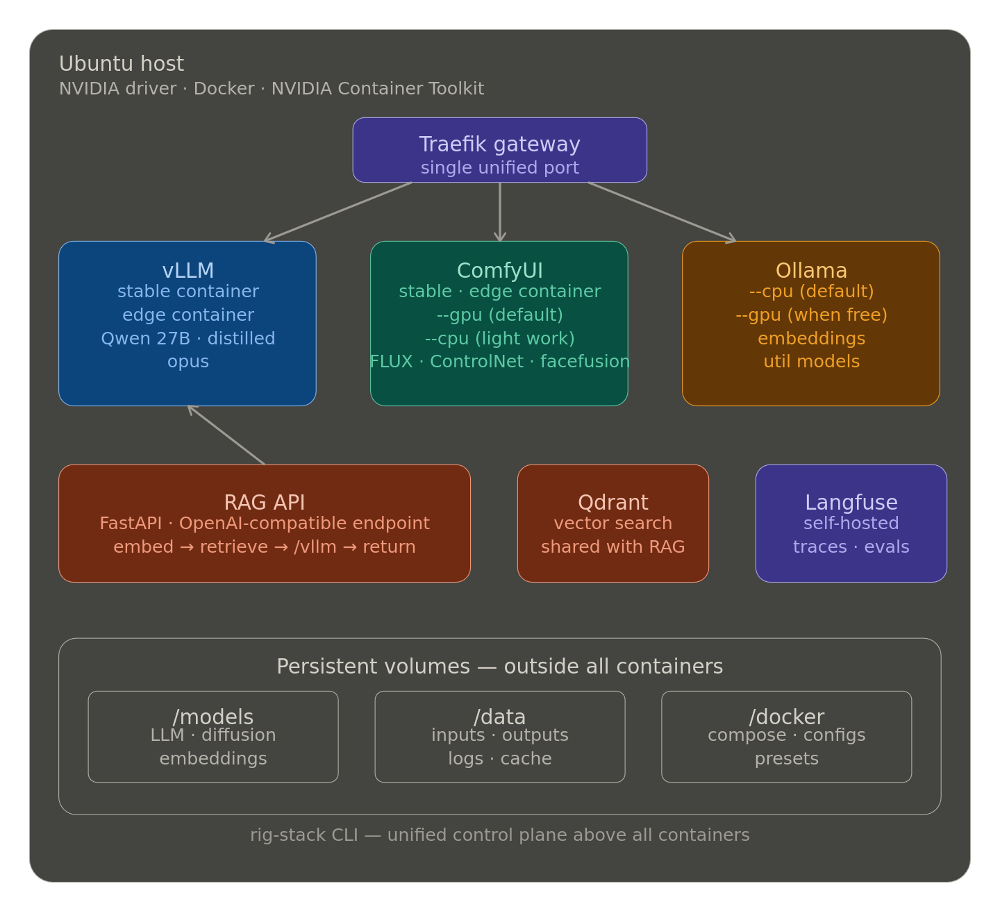
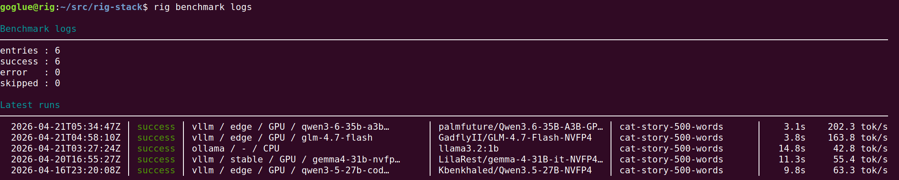

# RigStack

## Turn your GPU into a managed private AI cloud.

Built for developers and researchers who want production-grade local inference on NVIDIA hardware — without cloud overhead, per-token costs, or vendor lock-in.

RigStack is an open-source CLI that unifies Ollama, vLLM, and ComfyUI behind a single interface and routes everything through one endpoint using Traefik.

Run models on CPU or GPU, manage presets, install models easily, benchmark and monitor your entire setup with a simple, idempotent, Unix-friendly CLI.

No cloud. No per-token costs. Just fast, secure local inference that unleashes your creative work.



*Powerful, friendly CLI with bash and zsh completion — manage your entire private AI server in one command.*

## Features

- **Native CLI**  
  Manage your entire AI stack with a single command. Switch presets, move models between CPU/GPU, and control all services with a fast, composable CLI.

- **Single endpoint**  
  Multiple inference services routed through Traefik on port 80 and 443. One host, one entry point.

- **Observability**  
  One command to see endpoint availability, current system configuration, and memory distribution: `rig status`.

- **Unified model registry**  
  Manage models across vLLM, Ollama, and ComfyUI from one interface — no more model sprawl.

- **Inference presets**  
  Define multiple configs for the same model (quantization, context length, throughput) and switch instantly with `rig serve <preset>`.

- **Smart GPU/CPU split**  
  Place each model on GPU or CPU based on your needs. Optimize your rig for the current workload and switch configurations in one command.

- **Edge GPU builds**  
  Unlock 40–60% more performance on modern GPUs (e.g. RTX 5090) with containerized nightly PyTorch builds. Use stable for compatibility, or switch to edge for maximum throughput.

- **Built-in RAG**  
  `/rag` endpoint powered by Qdrant, ready to plug into apps.

- **Self-hosted prompt observability**  
  Langfuse traces every request. Nothing leaves your network.

- **Trusted-network design**  
  No auth overhead, no cloud dependency.

- **Containerized stack**  
  Docker-based, reproducible, easy to start, easy to evolve.

---

## What's included

All services are exposed under a single Traefik gateway on port 80, or with TLS termination on port 443:

| Component | Stack | Route |
|---|---|---|
| LLM inference | vLLM (stable + Blackwell-edge) | `/v1` |
| Image/Video generation | ComfyUI (CPU + stable + Blackwell-edge) | `/comfy` |
| Utility models | Ollama (CPU/GPU) | `/ollama/v1/` |
| RAG API | FastAPI + Qdrant | `/rag/v1` |
| Observability | Langfuse (self-hosted) | `/langfuse` |
| Gateway | Traefik | `http://localhost:80`, `https://localhost:443` |

---

## Prerequisites

### System requirements
- Ubuntu or Debian-family with `OS_FAMILY=debian` in `.env` (Tested on Ubuntu 24.04)
- 16GB+ RAM (32GB+ recommended for larger models)
- 2tb+ disk (for models, data, and Docker storage)
- NVIDIA RTX 5090 (or any NVIDIA GPU ≥ RTX 30xx; Blackwell builds (--edge) require RTX 50xx)

### Package requirements
- NVIDIA driver ≥ 580
- Docker CE (not snap)
- NVIDIA Container Toolkit

Or just run `./install.sh` — it handles all of the above.

---

## Quick start

```bash
# 1. Clone and configure
git clone https://github.com/gogluejf/rig-stack.git && cd rig-stack
cp .env.example .env
# Edit .env — set MODELS_ROOT, DATA_ROOT, DOCKER_ROOT to match your server

# 2. Install everything (driver, Docker, toolkit, CLI)
./install.sh

# 3. Download models
rig models init --minimal

# 4. Start serving
rig serve qwen3-6-27b-nvfp4
# On Blackwell (RTX 50xx)? Squeeze every FLOP out of your card:
# rig serve qwen3-6-27b-nvfp4 --edge
```

The LLM endpoint is live at `https://localhost/v1`.



*Switch models and presets in one command — tune quantization, context length, and throughput on the fly.*

---

## CLI reference

`rig` is your command center for managing the whole stack — services, models, presets, and more.

```
rig <command> [subcommand] [flags]
```

**Services availability**



*Every endpoint in your stack at a glance — gateway, services, and live availability in one command.*

**Hardware usage**



*Full visibility on your setup — gateway status, active services, GPU and CPU memory utilisation for your running model.*

---

## Architecture

A single endpoint, multiple services. Traefik routes incoming requests to the right backend — vLLM for LLM inference, ComfyUI for image generation, Ollama for utility models, and the RAG API for retrieval. All traffic flows through port 80 (or 443 with TLS). Langfuse made available to captures traces across every service you consume without any data leaving your network.



---

## Field-tested configurations

> Results on RTX 5090 (32 GB VRAM), single-stream throughput with greedy decoding. This project is actively evolving — configurations are validated as new models and builds are tested.

**vLLM**

| Model | Container | Throughput | Context |
|---|---|---|---|
| sakamakismile/Qwen3.6-27B-NVFP4 | edge | ~60 tok/s | ~53k |
| Kbenkhaled/Qwen3.5-27B-NVFP4 | edge | ~65 tok/s | ~48k |
| palmfuture/Qwen3.6-35B-A3B-GPTQ-Int4 | edge | ~200 tok/s | ~130k |
| GadflyII/GLM-4.7-Flash-NVFP4 | edge | ~170 tok/s | ~144k |
| LilaRest/gemma-4-31B-it-NVFP4-turbo | stable | ~55 tok/s | ~18k |

**Ollama** — Gemma, Llama (CPU and GPU offload)

**Coming soon**

| Component | Status |
|---|---|
| ComfyUI | Benchmarks pending |
| RAG API | Functional POC — planned rewrite as agentic proxy with web search and persistent LLM memory |

**Test your inference**


*`rig test` and `rig benchmark` validate every service in your stack — chat, vision, and more — and compile results into clean benchmark logs.*

---

## Benchmark



*Use `rig benchmark logs` to get the full details of your test run.*

---


## How to add a model

Models management made easy. `rig models install` handles Hugging Face, Ollama, and ComfyUI models — just provide the source and type.

```bash
# Install a full Hugging Face repository
rig models install <huggingface-repo-id>

# Install an Ollama model
rig models install phi3:mini --type ollama

# Install a model via ComfyUI (requires rig comfy start)
rig models install black-forest-labs/FLUX.1-dev --type comfy

# Install a single file from a ComfyUI model repo
rig models install TencentARC/GFPGAN --file GFPGANv1.4.pth --type comfy

```

For gated models (some Llama, Qwen variants), and faster download,  set `HF_TOKEN` in your `.env`.

---

## How to add a preset

A **preset** is an env file in `presets/vllm/` with operational parameters for vLLM.

Presets let you manage different vLLM configurations and switch from one setup to another without headache.

Create one by copying an existing preset and adjusting the values:

```bash
cp presets/vllm/qwen3-6-27b-nvfp4.sh presets/vllm/my-preset.sh
# Edit my-preset.sh
rig serve my-preset
```

See `presets/README.md` for the full parameter reference.

---

## How to rebuild edge images

Edge images (Blackwell/sm_120) need to be rebuilt when PyTorch nightly or vLLM updates significantly:

```bash
bash scripts/setup/04-build-edge-images.sh
```

Or to update all images:

```bash
bash scripts/maintenance/update-images.sh
```

---

## Accessing from another machine

**Simple — SSH tunnel over HTTP (recommended for private networks)**

Traffic is encrypted by the SSH tunnel itself. No certificate setup needed.

```bash
ssh -L 8080:localhost:80 user@<server-ip>
# then access via http://localhost:8080
curl http://localhost:8080/v1/models
```

**Secure — SSH tunnel over HTTPS (with trusted certificate)**

Full end-to-end TLS. Requires trusting the mkcert CA on the remote machine once.

```bash
# 1. Create the destination directory (if it doesn't exist)
mkdir -p ~/.local/share/mkcert

# 2. Copy the CA from the server (one-time)
scp user@<server-ip>:~/.local/share/mkcert/rootCA.pem ~/.local/share/mkcert/rootCA.pem
scp user@<server-ip>:~/.local/share/mkcert/rootCA-key.pem ~/.local/share/mkcert/rootCA-key.pem

# 3. Install it (handles browser + system store)
sudo apt install -y mkcert libnss3-tools
mkcert -install

# 4. Open an SSH tunnel
ssh -L 8443:localhost:443 user@<server-ip>

# 5. Access via the tunnel
curl https://localhost:8443/v1/models
```

For VS Code extensions (Roo Code, Copilot, etc.) add to `~/.bashrc` and restart VS Code:

```bash
export NODE_EXTRA_CA_CERTS="$HOME/.local/share/mkcert/rootCA.pem"
```

**Alternatively — bring your own certificate**

If you plan to access the stack from many machines or expose it externally, replace the mkcert cert with a properly signed one (Let's Encrypt, commercial CA, etc.):

```bash
# Replace these two files with your own cert and key
config/traefik/certs/local.crt
config/traefik/certs/local.key

# Then restart Traefik
docker compose restart traefik
```

---

## Storage layout

Keep models, data, and Docker storage separate from the inference services themselves.
I would recommend at least 2 TB of free space for a smooth experience, especially if you plan to work with larger models or multiple models simultaneously.
Docker by itself with cache and images can easily consume 130 GB+. on my setup.
I keep 800 GB free for models, the rest for my data and Docker storage, though this will be use when playing with comfy workflows and RAG.

If your server uses different paths than `/models`, `/data`, `/docker`, edit `.env`:

```bash
MODELS_ROOT=/your/models/path
DATA_ROOT=/your/data/path
DOCKER_ROOT=/your/docker/path

```

`DOCKER_ROOT` has two roles:

- **Always used** for rig-stack control-plane bind mounts (for example Traefik/Qdrant config and active preset files).
- **Optionally used** for Docker engine + containerd storage during setup step 02, only if you explicitly confirm the relocation prompt.

If Docker already runs other workloads on the host, keep existing engine/containerd roots unless you intentionally migrate data first.

Run `bash scripts/setup/00-init-dirs.sh` to create the subdirectory tree at the new paths.

---

## Extending to other GPUs / OS

| Variable | Options | Effect |
|---|---|---|
| `GPU_MODEL` | `rtx5090`, `rtx4090`, etc. | Validation messaging in setup scripts |
| `OS_FAMILY` | `ubuntu`, `debian` | Apt codename resolution in setup scripts |
| `OS_VERSION` | `24.04`, `22.04`, etc. | Apt codename resolution |

For non-Blackwell GPUs, use `rig serve <preset>` (stable container) — the edge container is only needed for sm_120 (RTX 5090).

---

## Roadmap

- **Agent Gateway** — evolve the RAG endpoint into a full server-side agent: web search, Python sandbox, dynamic knowledge base, and persistent LLM memory
- **MCP server** — expose your private AI cloud as an MCP tool layer, pluggable into any MCP-compatible client
- **SGLang support** — add SGLang as an alternative inference backend alongside vLLM
- **llama.cpp support** — cover quantized formats not yet supported by vLLM
- **ComfyUI workflows** — manage and trigger workflows via `rig comfy workflow`
- **API key authentication** — optional key-based auth for external access with zero overhead on localhost
- **Broader edge support** — extend nightly PyTorch builds beyond Blackwell / RTX 50xx
- **Multi-distro support** — expand the installer beyond Debian/Ubuntu
- **Model metadata endpoint** — a gateway route that surfaces model capabilities and descriptions dynamically

---

## License

This project is licensed under the MIT License. See [LICENSE](LICENSE).
